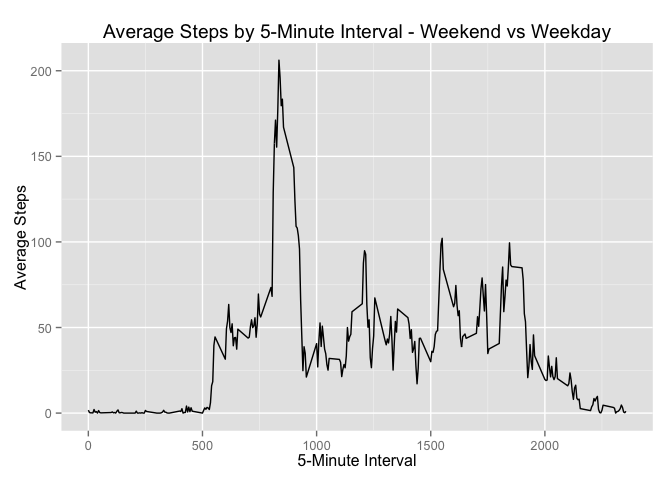
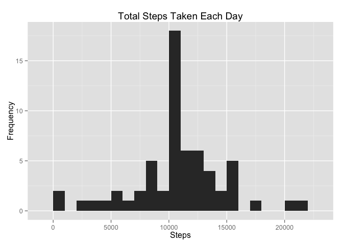
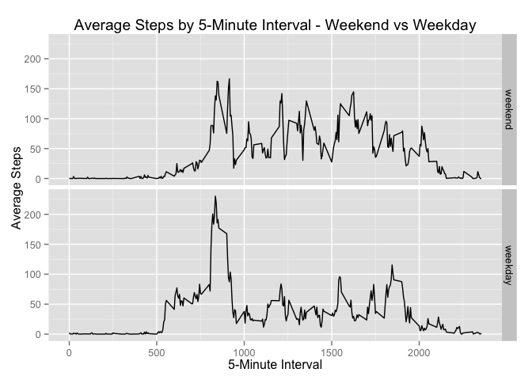

# Reproducible Research: Peer Assessment 1
Santiago Oleas  
September 17, 2015  
## Introduction
It is now possible to collect a large amount of data about personal movement using activity monitoring devices such as a Fitbit, Nike Fuelband, or Jawbone Up. These type of devices are part of the “quantified self” movement – a group of enthusiasts who take measurements about themselves regularly to improve their health, to find patterns in their behavior, or because they are tech geeks. But these data remain under-utilized both because the raw data are hard to obtain and there is a lack of statistical methods and software for processing and interpreting the data.

The purpose of this assignment is to take this data, analyze and answer some specific questions outlined below.

<HR>
## Loading and preprocessing the data
The data is provided within the forked and cloned repository http://github.com/rdpeng/RepData_PeerAssessment1 and is found in a zip file called activity.zip.

**File Information**  

* **Compressed Filename**: activity.zip  
* **Uncompresed Filename**: activity.csv  
* **File type**: CSV, comma-delimited  
* **Number of Observations**: 17 568  
* **Data Columns**  
    * **steps**: Number of steps taken in a 5-minute interval (missing values are coded as NA)
    * **date**: the date on which the measurement was taken in YYYY-MM-DD format
    * **interval**: Identifier for the 5-minute interval in which measurement was taken

#### Show any code that is needed to  
#### 1. Load the data (i.e. read.csv())  
#### 2. Process/transform the data (if necessary) into a format suitable for your analysis

Set the working directory to the local git repo. 

```r
setwd("/Users/santiago/git/coursera/5 - Reproducible Research/RepData_PeerAssessment1")
```

Confirm working directory is correct.

```r
getwd()
```

```
## [1] "/Users/santiago/git/coursera/5 - Reproducible Research/RepData_PeerAssessment1"
```

Unzip the activity.zip file.

```r
unzip("./activity.zip", overwrite = TRUE)
```

Load activity.csv file into a data frame called **_movementData_**.

```r
movementData <- read.csv(file="activity.csv", header=TRUE, sep=",")
```

Convert date string in YYYY-MM-DD format into date data type. 


```r
movementData$date <- as.POSIXct(movementData$date, format="%Y-%m-%d")
```


Confirm data table matches what we expect, which is 17 568 records with the three columns (steps, date, interval) provided in the original CSV file plus This concludes the Loading and Preprocessing the Data requirement.

```r
str(movementData)
```

```
## 'data.frame':	17568 obs. of  3 variables:
##  $ steps   : int  NA NA NA NA NA NA NA NA NA NA ...
##  $ date    : POSIXct, format: "2012-10-01" "2012-10-01" ...
##  $ interval: int  0 5 10 15 20 25 30 35 40 45 ...
```

<HR>
## What is mean total number of steps taken per day?

Using the dplyr function create a data table summarizing the total number of steps taken each day while removing the NA values in **_movementData$steps_** column.  A new data frame called **_movementDataNARemoved_** will be created.


```r
# load dplyr library
library(dplyr)
```

```
## 
## Attaching package: 'dplyr'
## 
## The following objects are masked from 'package:stats':
## 
##     filter, lag
## 
## The following objects are masked from 'package:base':
## 
##     intersect, setdiff, setequal, union
```

```r
# Create parallel data set with NA rows removed
movementDataNARemoved <- na.omit(movementData)

# create group_by of movementDataNARemoved by date
dailyMovementData <- group_by(movementDataNARemoved, date)

# summarize steps by date
dailyMovementData <- summarize(dailyMovementData,steps=sum(steps))
```

#### For this part of the assignment, you can ignore the missing values in the dataset.  
#### 1. Make a histogram of the total number of steps taken each day.


Using the summarized **_dailyMovementData_** a histogram will be produced to show total number of steps taken each day.  The bin width was explicitly set to 1000 to show the number of days within each block of 10000 steps.


```r
library(ggplot2)
qplot(dailyMovementData$steps, geom = "histogram",
                               main = "Total Steps Taken Each Day",
                               xlab = "Steps",
                               ylab = "Frequency",
                               binwidth = 1000)
```

 

#### For this part of the assignment, you can ignore the missing values in the dataset.  
#### 2. Calculate and report the **mean** and **median* total number of steps taken per day.

Calculate the **mean** total number of steps taken per day

```r
# Mean using dailyMovementData previously built with NA values already removed
meanSteps <- mean(dailyMovementData$steps)
```
The mean number of steps is 10766.19.

Calculate the **median** total number of steps taken per day

```r
# Median using dailyMovementData previously built with NA values already removed
medianSteps <- median(dailyMovementData$steps)
```
The median number of steps is 10765.


<HR>
## What is the average daily activity pattern?

Using the dplyr function create a data table summarizing the AVERAGE number of steps by 5-minute interval across all days.  Since a data frame with NA removed called **_movementDataNARemoved_** was already created, this will be used to calculate the average.


```r
# load dplyr library
library(dplyr)

# create group_by of movementData by 5-minute interval
intervalMovementData <- group_by(movementDataNARemoved, interval)

# summarize steps by 5-minute interval ignoring NA values
intervalMovementData <- summarize(intervalMovementData,steps=mean(steps))
```

#### 1. Make a time series plot (i.e. type = "l") of the 5-minute interal (x-axis) and the average number of steps taken, averaged across all days (y-axis)

Produce the timeseries plot showing the the 5-minute interval across the x-axis and show the average steps across all days on the y-axis. 

```r
g <- ggplot(intervalMovementData, aes(x=interval, y=steps))
g + geom_line() + xlab("5-Minute Interval") + ylab("Average Steps") + ggtitle("Average Steps by 5-Minute Interval - Weekend vs Weekday")
```

 

#### 2. Which 5-minute interval, on average across all the days in the dataset, contains the maximum number of steps?

Using the data frame **_intervalMovementData_** created in the previous step determine which row contains the maximum average step and return the interval number.

```r
maxInterval <- intervalMovementData$interval[which.max(intervalMovementData$steps)]

maxAvgSteps <- max(intervalMovementData$steps)
```
The maximum interval is 835 with an average of 206.1698113.


<HR>

## Imputing missing values

Note that there are a number of days/intervals where there are missing values (codesd as NA). The presence of missing days may introduce bias into some calculations or summaries of the data.

#### 1. Calculate and report the total number of missing values in the dataset (i.e. the total number of rows with NAs)


```r
NACount <- sum(is.na(movementData$steps))
```
The total number of rows with NA is 2304.

#### 2. Devise a strategy for filling in all of the missing values in the dataset.  The strategy does not need to be sophisticated. For example, you could use the mean/median for that day, or the mean for that 5-minute interval. etc.

The **_movementData_** data frame contains the NA rows and the strategy here will be to take the 5-minute interval average calculated previously and stored in the **_intervalMovementData"_** data frame and put these values on any NA rows.

#### 3. Create a new Datadataset that is equal to the original dataset but with the missing data filled in.

The method that will be used is to join **_movementData_** and **_intervalMovementData_** into a new data frame called **_transformedMovementData_**.  The function ifelse() will be used to test the NA value with is.na().  If the value of steps is found to be NA then the average 5-minute interval value found in **_intervalMovementData_** value will be assigned to a new column called **_transformedMovementData$stepsTransformed_** otherwise the original steps value will be used.

Since we are joining **_movementData_** and **_intervalMovementData_** and both have the columns **steps** the **_intervalMovementData_** one will be named to **averageSteps**.  We can then join the two data frames into a new one called **_transformedMovementData_**.


```r
intervalMovementData <- rename(intervalMovementData, averageSteps = steps)

transformedMovementData <- merge(movementData, intervalMovementData, by.x = 'interval', by.y = 'interval', all=TRUE)
```

Now the column transformedMovementData$steps will be transformed if it has a NA value by assigning the **_transformedMovementData$averageSteps_** value.


```r
for (i in 1:nrow(transformedMovementData)) {
    if (is.na(transformedMovementData$steps[i])) {
        transformedMovementData$steps[i] <- transformedMovementData$averageSteps[i]
    }
}
```

We can confirm by counting the number of NA rows in **_transformedMovementData_**.

```r
transformedNACount <- sum(is.na(transformedMovementData$steps))
```

The total number of rows with NA is 0.

#### 4. Make a histogram of the total number of steps taken each day and calaulate and report the **mean** and **median** total number of steps taken per day.  Do these values differ from the estimates from the first part of the assignment?  What is the impact of inputing missing data on the estimates of the total daily number of steps?

Using the dplyr function create a data table summarizing the total number of steps taken each day while removing the NA values in **_transformedMovementData$steps_** column.

```r
# load dplyr library
library(dplyr)

# create group_by of movementData by date
transformedDailyMovementData <- group_by(transformedMovementData, date)

# summarize steps by date ignoring NA values
transformedDailyMovementData <- summarize(transformedDailyMovementData,steps=sum(steps, na.rm=TRUE))
```

Using the summarized **_transformedDailyMovementData_** a histogram will be produced to show total number of steps taken each day.  The bin width was explicitly set to 1000 to show the number of days within each block of 10000 steps.


```r
library(ggplot2)
qplot(transformedDailyMovementData$steps, geom = "histogram",
                               main = "Total Steps Taken Each Day",
                               xlab = "Steps",
                               ylab = "Frequency",
                               binwidth = 1000)
```

 


Calculate the **mean** total number of steps taken per day for the transformed data set in **_transformedDailyMovementData_**.


```r
# Mean using transformedDailyMovementData previously built
transformedMeanSteps <- mean(transformedDailyMovementData$steps)
```
The mean number of steps is 10766.19.

Calculate the **median** total number of steps taken per day for the transformed data set in **_transformedDailyMovementData_**.


```r
# Median using transormedDailyMovementData previously built
transformedMedianSteps <- median(transformedDailyMovementData$steps)
```
The median number of steps is 10766.19.

To answer the question: **Do these values differ from the estimates from the first part of the assignment?**

Previously using the data set where the NA value was removed, the mean was 10766.19 and the median was  10765.  The mean remained the same but the median did not.

To answer the second question: **What is the impact of inputing missing data on the estimates of the total daily number of steps?**

We can see that forcing a value to the NA records changed the median.

<HR>
## Are there differences in activity patterns between weekdays and weekends?

#### For this part the weekdays() function may be of some help here.  Use the dataset with the filled in missing values for this part.
#### 1. Create a new factor variable in the dataset with two levels - "weekday" and "weekend" indicating whether a given date is a weekday or weekend day.

A new column classifying the date as Weekend or Weekday will be added to **_transformedMovementData_** by using the timeDate library function isWeekend(). These are then converted to factors and not left as string values.

```r
library('timeDate')
transformedMovementData$dayType <- ifelse(isWeekend(transformedMovementData$date), "weekend", "weekday")
transformedMovementData$dayType <- factor(transformedMovementData$dayType,levels=c("weekend","weekday"))
```

#### 2. Make a panel plot containing a time series plot (i.e. type = "l") of the 5-minute interval (x-axis) and the average number of steps taken, averaged across all weekday days or weekend days (y-axis).


```r
# create group_by of movementData by 5-minute interval
transformedIntervalMovementData <- group_by(transformedMovementData, interval, dayType)

# summarize steps by 5-minute interval ignoring NA values
transformedIntervalMovementData <- summarize(transformedIntervalMovementData,steps=mean(steps))
str(transformedIntervalMovementData)
```

```
## Classes 'grouped_df', 'tbl_df', 'tbl' and 'data.frame':	576 obs. of  3 variables:
##  $ interval: int  0 0 5 5 10 10 15 15 20 20 ...
##  $ dayType : Factor w/ 2 levels "weekend","weekday": 1 2 1 2 1 2 1 2 1 2 ...
##  $ steps   : num  0.2146 2.2512 0.0425 0.4453 0.0165 ...
##  - attr(*, "vars")=List of 1
##   ..$ : symbol interval
##  - attr(*, "drop")= logi TRUE
```


With the average steps calculated by  5-minute interval and dayType (Weekend vs Weekday) we can now plot a time series with Weekend vs Weekday.


```r
g <- ggplot(transformedIntervalMovementData, aes(x=interval, y=steps))
g + geom_line() + facet_grid(dayType ~ .) + xlab("5-Minute Interval") + ylab("Average Steps") + ggtitle("Average Steps by 5-Minute Interval - Weekend vs Weekday")
```

 

This concludes the assignment.
